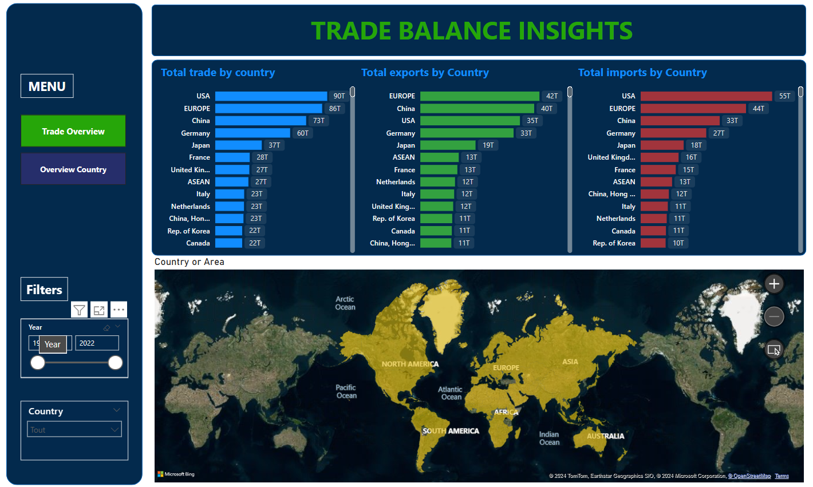
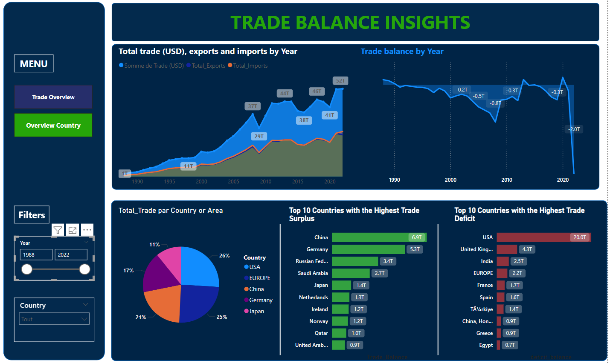

# TRADE BALANCE INSIGHTS

## Description
**TRADE BALANCE INSIGHTS** est un projet d'analyse des échanges commerciaux entre différents pays, de 1988 à 2022. Grâce à des visualisations interactives développées dans **Power BI**, ce projet permet de comprendre l'évolution des échanges commerciaux mondiaux, en mettant l'accent sur la balance commerciale (importations vs exportations), les tendances régionales, les variations annuelles, et les impacts économiques globaux.

## Objectifs
Le projet vise à fournir des insights approfondis pour :
- Suivre les tendances des échanges commerciaux sur une période de 34 ans.
- Identifier les pays ayant une balance commerciale excédentaire ou déficitaire.
- Analyser l'impact de différents événements économiques sur le commerce international.
- Visualiser les échanges par région, pays, ou secteur économique.

## Fonctionnalités principales
- **Évolution temporelle** : Comparaison des volumes d'exportations et d'importations sur plusieurs années.
- **Analyses par pays** : Visualisation des échanges commerciaux pour chaque pays, avec distinction entre excédent et déficit.
- **Comparaison régionale** : Visualisation des échanges par région (Europe, Amérique, Asie, etc.).
- **Analyse sectorielle** : Focus sur des secteurs spécifiques (énergie, technologie, etc.) pour comprendre les variations dans le commerce de biens spécifiques.
- **Filtres dynamiques** : Possibilité de filtrer les données par année, pays, ou secteur pour des analyses ciblées.

## Structure du projet

### 1. **Données**
Les données utilisées dans ce projet proviennent de sources officielles comme l'Organisation Mondiale du Commerce (OMC) ou la Banque Mondiale. Elles couvrent :
- Volumes d'exportations et d'importations par pays et par année.
- Valeurs monétaires associées aux échanges commerciaux.
- Secteurs économiques.

### 2. **Prétraitement**
Les données brutes ont été :
- **Nettoyées** : Suppression des valeurs aberrantes, gestion des valeurs manquantes.
- **Agrégées** : Par année, par pays, et par secteur économique.
- **Standardisées** : Conversion des monnaies pour permettre des comparaisons temporelles.

### 3. **Power BI**
- **Dashboards** : Création de tableaux de bord interactifs pour explorer les données.
- **Visualisations** : Graphiques en lignes, cartes géographiques, diagrammes en barres, etc.
- **Filtres interactifs** : Filtres pour choisir des plages temporelles ou des pays spécifiques.

## Prérequis

Pour utiliser ce projet, vous devez avoir installé :
- **Power BI Desktop** (version la plus récente)
- Un accès aux sources de données (ou un fichier CSV/Excel exporté).

## Screenshots
**Home**

**Overview country**
